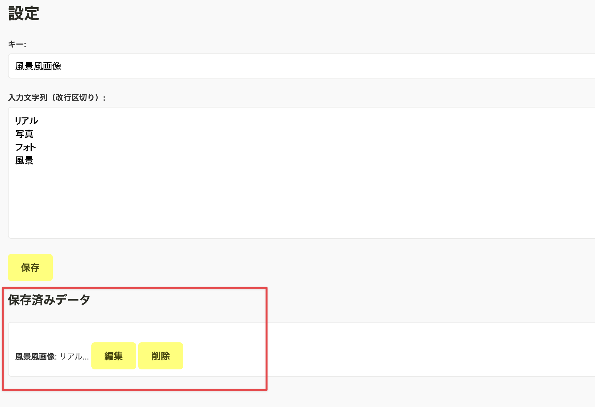

# puitag

AIイラスト・AIフォト・AIグラビア専用の投稿サイトである『chichi-pui（ちちぷい）』で画像投稿時にタグを一括入力するためのChrome拡張機能です。

## 使い方

Chrome拡張機能をインストールしたら、`詳細` ボタンを押します

詳細画面内にある `拡張機能のオプション` を押します

一括入力したいタグを改行区切りで入力して、キーとともに保存します

保存したタグは編集や削除が可能です

Chrome拡張機能をインストールした状態で、ちちぷいの作品投稿画面を開くと、このように入力したタグキーが選択できるようになっているので、一括入力したいタグキーを選択して、`タグを一括入力` ボタンを押してください

すると、設定したタグの一括入力が行われます

## License

MIT